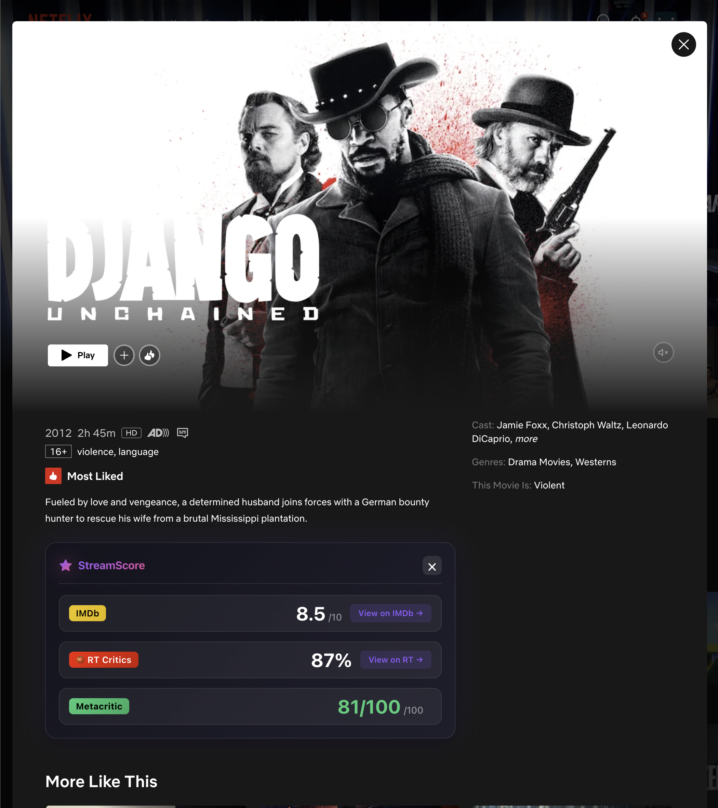
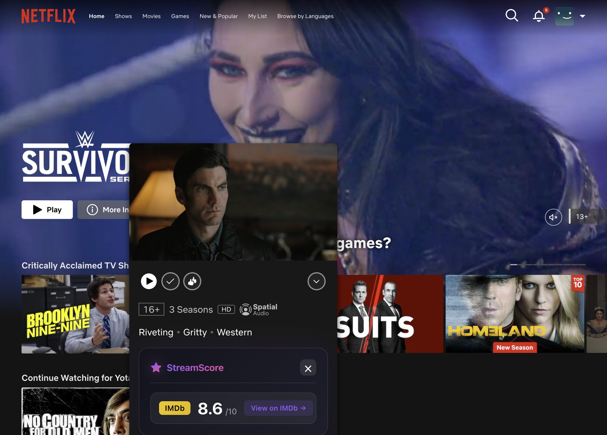
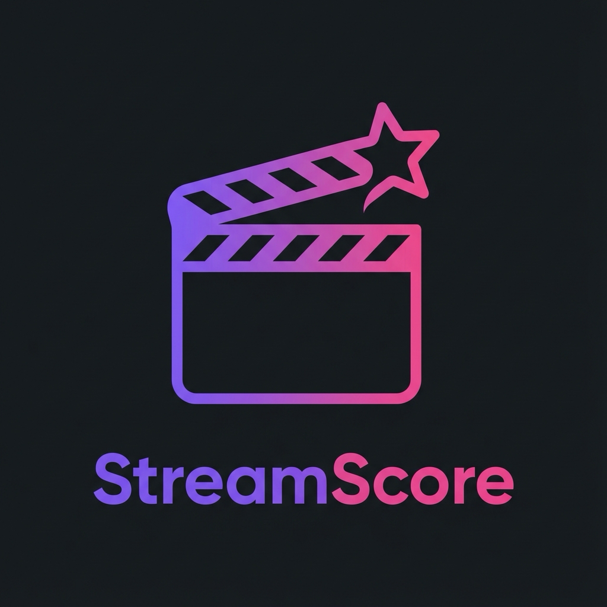

# StreamScore 🎬⭐

**Display IMDb and Rotten Tomatoes ratings directly on Netflix, Disney+, Apple TV+, and Prime Video!**

StreamScore is a browser extension that automatically shows movie and TV show ratings from IMDb and Rotten Tomatoes when you browse your favorite streaming platforms. Make informed decisions about what to watch without leaving the streaming site.

## 🎥 See It In Action


_StreamScore automatically displays IMDb and Rotten Tomatoes ratings on Netflix detail pages and hover previews._

<details>
<summary>📸 More Screenshots</summary>

### Netflix Detail Page



### Netflix Hover Preview (Mini-Modal)



</details>



## Features

✨ **Automatic Rating Display**

- Shows ratings on movie/show preview pages before you start watching
- IMDb ratings with vote counts
- Rotten Tomatoes critic scores (Tomatometer)
- Rotten Tomatoes audience scores (when available)
- Metacritic scores (bonus)

🎯 **Supported Platforms**

- **Netflix** - Browse and title pages
- **Disney+** - All content detail pages
- **Apple TV+** - Show and movie pages
- **Amazon Prime Video** - Video detail pages

🎨 **Beautiful Design**

- Modern glassmorphism UI
- Dark theme that blends seamlessly with streaming platforms
- Smooth animations and transitions
- Non-intrusive and dismissible

🔒 **Privacy First**

- No data collection
- No tracking
- API key stored locally
- All processing happens in your browser

## Installation

### Chrome / Edge / Brave / Opera (Chromium-based browsers)

1. **Download the Extension**

   - Clone or download this repository
   - Or download the latest release ZIP

2. **Get a Free OMDb API Key**

   - Visit [http://www.omdbapi.com/apikey.aspx](http://www.omdbapi.com/apikey.aspx)
   - Select "FREE" plan (1,000 daily requests)
   - Enter your email and activate your key

3. **Install the Extension**

   - Open your browser and navigate to:
     - Chrome: `chrome://extensions/`
     - Edge: `edge://extensions/`
     - Brave: `brave://extensions/`
   - Enable "Developer mode" (toggle in top-right)
   - Click "Load unpacked"
   - Select the `StreamScore` folder

4. **Configure API Key**
   - Click the StreamScore icon in your browser toolbar
   - Paste your OMDb API key
   - Click "Save Settings"
   - You'll see a green indicator when the key is valid ✓

## Usage

1. **Browse Any Supported Platform**

   - Go to Netflix, Disney+, Apple TV+, or Prime Video
   - Navigate to any movie or show preview/details page

2. **View Ratings Automatically**

   - StreamScore will automatically detect the title
   - Ratings will appear in a sleek widget on the page
   - Click the rating sources to view full details on IMDb/RT

3. **Dismiss the Widget**
   - Click the × button to hide the widget
   - It will reappear when you navigate to a different title

## How It Works

```
┌─────────────────┐
│ Streaming Page  │
│  (Netflix, etc) │
└────────┬────────┘
         │
         ├─► StreamScore detects title
         │
         ├─► Sends to background service
         │
         └─► Background fetches from OMDb API
                     │
                     ├─► IMDb ratings
                     ├─► Rotten Tomatoes scores
                     └─► Metacritic scores
                              │
                              ├─► Cache results (24 hours)
                              │
                              └─► Display in widget
```

## Development

### Project Structure

```
StreamScore/
├── manifest.json           # Extension configuration
├── background.js           # Service worker (API calls)
├── content/
│   ├── utils.js           # Shared utilities
│   ├── widget.js          # Widget creation
│   ├── widget.css         # Widget styling
│   ├── netflix.js         # Netflix content script
│   ├── disney.js          # Disney+ content script
│   ├── appletv.js         # Apple TV+ content script
│   └── prime.js           # Prime Video content script
├── popup/
│   ├── popup.html         # Settings popup
│   ├── popup.js           # Popup logic
│   └── popup.css          # Popup styling
├── icons/                 # Extension icons
└── README.md
```

### Local Development

1. Make changes to the code
2. Go to `chrome://extensions/`
3. Click the reload icon on the StreamScore extension
4. Test on streaming platforms

### Testing

**Quick Test:**

```bash
# 1. Install extension in Chrome/Edge
# 2. Configure OMDb API key in popup
# 3. Visit Netflix and browse to any title
# 4. Check that ratings appear
```

## API Rate Limits

The free OMDb API tier includes:

- **1,000 requests per day**
- StreamScore caches results for 24 hours to minimize API usage
- Average user typically uses 10-50 requests per day

## Troubleshooting

### Widget Not Appearing?

- ✓ Check that your API key is configured (click extension icon)
- ✓ Verify you're on a title preview/details page (not the homepage)
- ✓ Try refreshing the page
- ✓ Check browser console for errors (F12)

### "Invalid API Key" Error?

- ✓ Ensure you activated your API key via the email from OMDb
- ✓ Check for typos when pasting the key
- ✓ Try generating a new key at omdbapi.com

### Ratings Not Accurate?

- Ratings are fetched from OMDb database
- Some titles may have different naming conventions
- Try the direct IMDb/RT links to verify

### Widget Blocking Content?

- Click the × button to dismiss
- Widget is designed to be non-intrusive
- Report layout issues on GitHub

## Contributing

Contributions are welcome! Please feel free to:

- Report bugs
- Suggest new features
- Submit pull requests
- Add support for new streaming platforms

## Roadmap

- [ ] Add support for more streaming platforms (Hulu, Peacock, etc.)
- [ ] Customizable widget position
- [ ] Dark/light theme toggle
- [ ] More rating sources (Letterboxd, IMDb user reviews)
- [ ] Keyboard shortcuts
- [ ] Safari support

## Privacy Policy

StreamScore does not collect, store, or transmit any personal data. All data processing happens locally in your browser:

- API key is stored in local browser storage only
- Rating requests go directly to OMDb API
- No analytics or tracking
- No user data is collected

## License

MIT License - see LICENSE file for details

## Credits

- Built with ❤️ for movie and TV lovers
- Ratings data from [OMDb API](http://www.omdbapi.com/)
- Icons and design by StreamScore team

## Support

For issues, questions, or suggestions:

- Open an issue on GitHub
- Check the troubleshooting section above

---

**Enjoy better streaming decisions with StreamScore! 🎬⭐**
